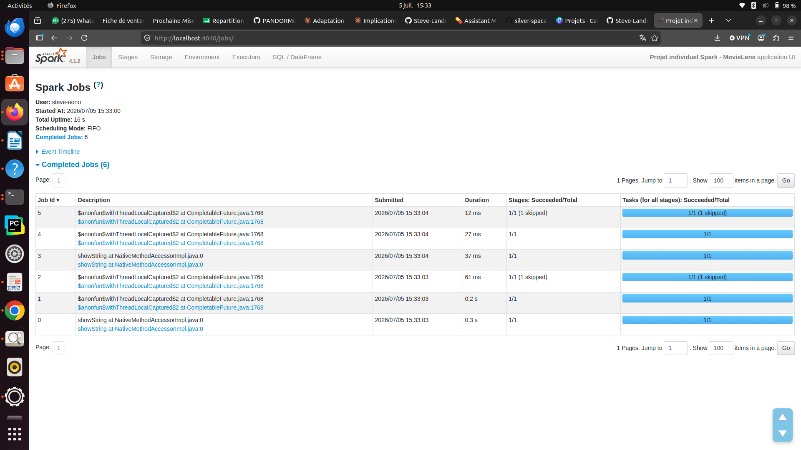
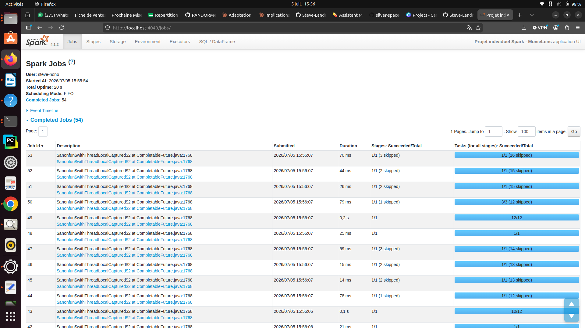
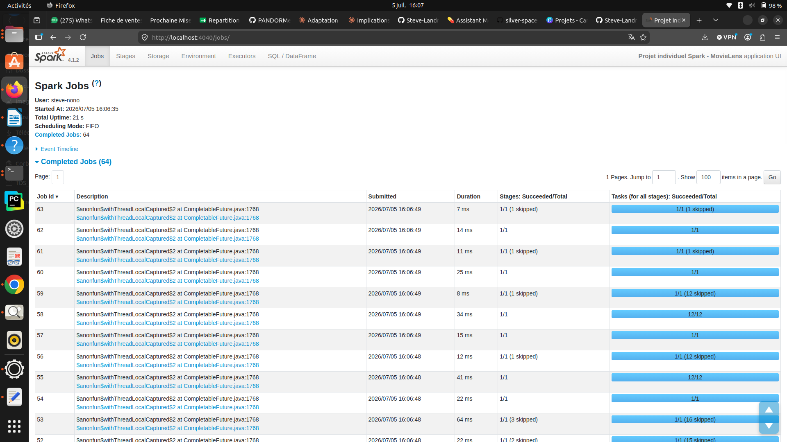

# Rapport de projet - Pipeline data Spark avec MovieLens

## Informations générales

- **Étudiant** : Steve Landry KOUOKAM NONO
- **Réalisation** : projet individuel
- **Formation** : MD4-HETIC
- **Jeu de données** : MovieLens small
- **Mode d'exécution** : PySpark en local sous Ubuntu
- **Livrable principal** : rapport écrit accompagné du code, des sorties et des captures Spark UI

---

## 1. Contexte et objectif du projet

Ce projet consiste à construire un pipeline data complet avec Apache Spark, depuis l'ingestion de fichiers CSV bruts jusqu'à la production de résultats analytiques exploitables.

Le projet a été réalisé individuellement. J'ai donc pris en charge l'ensemble de la chaîne de traitement : choix du jeu de données, structuration du dépôt, préparation de l'environnement, ingestion, nettoyage, analyses, optimisation, exploration complémentaire, observation de la Spark UI et rédaction du rapport.

L'objectif n'était pas de construire le pipeline le plus complexe possible, mais de produire un pipeline propre, reproductible, mesurable et correctement expliqué. Le travail suit une logique en trois couches :

```text
bronze : données brutes
silver : données nettoyées et typées
gold   : résultats analytiques
```

---

## 2. Jeu de données et schéma cible

### 2.1 Choix du jeu de données

J'ai choisi le jeu de données **MovieLens small**, car il permet de travailler sur un cas analytique clair : l'étude de notes attribuées par des utilisateurs à des films.

Ce jeu de données est adapté au projet car il permet de couvrir plusieurs notions importantes de Spark :

- ingestion de fichiers CSV ;
- schémas explicites avec `StructType` ;
- nettoyage et enrichissement des données ;
- jointure entre deux tables ;
- agrégations ;
- window functions ;
- optimisation par broadcast join ;
- exploration complémentaire avec comparaison entre fonction native Spark et UDF Python.

### 2.2 Fichiers utilisés

| Fichier | Utilisation |
|---|---|
| `ratings.csv` | Notes attribuées par les utilisateurs aux films |
| `movies.csv` | Informations descriptives sur les films |
| `tags.csv` | Non utilisé dans cette version |
| `links.csv` | Non utilisé dans cette version |

### 2.3 Volumes observés

| Table | Nombre de lignes brutes |
|---|---:|
| `ratings.csv` | 100 836 |
| `movies.csv` | 9 742 |

### 2.4 Schéma cible des notes

| Colonne | Type Spark | Rôle |
|---|---|---|
| `userId` | `IntegerType` | Identifiant utilisateur |
| `movieId` | `IntegerType` | Identifiant du film |
| `rating` | `DoubleType` | Note donnée par l'utilisateur |
| `timestamp` | `LongType` | Date de notation au format Unix |
| `date_note` | `TimestampType` | Date de notation lisible |
| `annee_note` | `IntegerType` | Année de notation, utilisée pour le partitionnement |

### 2.5 Schéma cible des films

| Colonne | Type Spark | Rôle |
|---|---|---|
| `movieId` | `IntegerType` | Identifiant du film |
| `title` | `StringType` | Titre du film |
| `genres` | `StringType` | Genres au format texte séparés par `|` |
| `genres_tableau` | `ArrayType(StringType)` | Genres transformés en tableau |
| `annee_sortie` | `IntegerType` | Année de sortie extraite du titre |

---

## 3. Architecture du pipeline

Le pipeline suit l'architecture suivante :

```text
data/datasets/ml-latest-small/*.csv
        ↓
ingestion bronze avec schémas explicites
        ↓
nettoyage et enrichissement
        ↓
data/output/silver/ au format Parquet
        ↓
analyses métier
        ↓
data/output/gold/ au format Parquet
```

J'ai choisi d'écrire la couche silver en Parquet afin de disposer d'un format colonnaire plus adapté aux lectures analytiques que le CSV.

La table des notes est partitionnée par `annee_note`. Cette colonne possède une cardinalité raisonnable et permet d'illustrer un partitionnement utile sans créer un nombre excessif de petits fichiers.

---

## 4. Ingestion bronze

L'ingestion bronze lit les fichiers CSV bruts avec des schémas explicites.

L'utilisation de `inferSchema` a volontairement été évitée. Définir les types manuellement permet de contrôler le comportement de Spark et de limiter les erreurs silencieuses de typage.

Extrait représentatif :

```python
schema_notes = StructType(
    [
        StructField("userId", IntegerType(), nullable=False),
        StructField("movieId", IntegerType(), nullable=False),
        StructField("rating", DoubleType(), nullable=False),
        StructField("timestamp", LongType(), nullable=False),
    ]
)
```

Contrôle après ingestion :

```text
ratings.csv : 100 836 lignes
movies.csv  : 9 742 lignes
```

La Spark UI a bien été ouverte pendant cette étape afin de vérifier le déclenchement des premiers jobs Spark.

{width=92%}

---

## 5. Nettoyage et couche silver

### 5.1 Nettoyage des notes

Les traitements appliqués sur les notes sont les suivants :

- suppression des doublons sur `userId`, `movieId` et `timestamp` ;
- suppression des valeurs manquantes critiques ;
- conservation uniquement des notes comprises entre 0.5 et 5.0 ;
- conversion du timestamp Unix en timestamp Spark ;
- extraction de l'année de notation dans `annee_note`.

Bilan :

```text
Lignes brutes ratings.csv      : 100 836
Lignes après nettoyage         : 100 836
Lignes écartées                : 0
```

Aucune ligne n'a été écartée sur ce fichier, ce qui indique que le fichier MovieLens small est déjà bien structuré pour les colonnes utilisées.

### 5.2 Nettoyage des films

Les traitements appliqués sur les films sont les suivants :

- suppression des doublons sur `movieId` ;
- suppression des valeurs manquantes critiques ;
- transformation de `genres` en tableau ;
- extraction de l'année de sortie depuis le titre.

Bilan :

```text
Lignes brutes movies.csv       : 9 742
Lignes après nettoyage         : 9 742
Lignes écartées                : 0
```

Lors du développement, une erreur de typage a été rencontrée sur l'extraction de `annee_sortie`. Certains titres ne contiennent pas d'année exploitable. Une première version du code tentait de convertir directement une chaîne vide en entier, ce qui provoquait une erreur Spark.

La correction a consisté à rendre l'extraction robuste : si l'année est absente, la valeur est conservée à `NULL` au lieu de bloquer le pipeline.

Extrait représentatif :

```python
.withColumn(
    "annee_sortie",
    F.when(
        F.col("annee_sortie_texte") != "",
        F.col("annee_sortie_texte").cast("int")
    ).otherwise(None)
)
```

### 5.3 Écriture silver

Les sorties silver sont écrites dans :

```text
data/output/silver/notes
data/output/silver/films
```

La table `notes` est partitionnée par `annee_note`.

---

## 6. Analyses métier gold

Les analyses sont réalisées à partir de la couche silver, et non directement à partir des CSV bruts. Cela permet de séparer clairement l'étape de préparation des données de l'étape analytique.

### 6.1 Analyse 1 - Films les mieux notés

**Question métier :** quels sont les films les mieux notés, en évitant les films avec trop peu de votes ?

Cette analyse utilise une agrégation par film :

```python
notes_par_film = (
    notes
    .groupBy("movieId")
    .agg(
        F.count("*").alias("nombre_votes"),
        F.round(F.avg("rating"), 2).alias("note_moyenne"),
    )
    .filter(F.col("nombre_votes") >= 50)
)
```

Un seuil minimal de 50 votes a été appliqué pour éviter de surclasser des films ayant une excellente note moyenne mais très peu d'avis.

Extrait de résultat :

```text
Shawshank Redemption, The (1994)  | 317 votes | 4.43
Godfather, The (1972)             | 192 votes | 4.29
Fight Club (1999)                 | 218 votes | 4.27
Dr. Strangelove (1964)            | 97 votes  | 4.27
Cool Hand Luke (1967)             | 57 votes  | 4.27
```

**Lecture métier :** les films les mieux classés sont majoritairement des classiques très reconnus. L'application d'un seuil de votes rend le classement plus fiable.

### 6.2 Analyse 2 - Popularité par genre

**Question métier :** quels genres concentrent le plus de notes ?

Cette analyse repose sur une jointure entre les notes et les films :

```python
notes_films = notes.join(films, on="movieId", how="inner")
```

La colonne `genres_tableau` est ensuite explosée avec `explode`, car un film peut appartenir à plusieurs genres.

Extrait de résultat :

```text
Drama      | 41 928 notes | 4 349 films | note moyenne 3.66
Comedy     | 39 053 notes | 3 753 films | note moyenne 3.38
Action     | 30 635 notes | 1 828 films | note moyenne 3.45
Thriller   | 26 452 notes | 1 889 films | note moyenne 3.49
Adventure  | 24 161 notes | 1 262 films | note moyenne 3.51
```

**Lecture métier :** les genres Drama et Comedy dominent en volume de notes. Cela montre qu'ils sont très présents dans le catalogue et fortement consommés par les utilisateurs.

### 6.3 Analyse 3 - Top films par genre avec window function

**Question métier :** quels sont les meilleurs films à l'intérieur de chaque genre ?

Cette analyse utilise une window function :

```python
fenetre_genre = Window.partitionBy("genre").orderBy(
    F.desc("note_moyenne"),
    F.desc("nombre_votes"),
    F.asc("title"),
)
```

Le classement est produit avec `row_number()` :

```python
.withColumn("rang", F.row_number().over(fenetre_genre))
```

Extrait de résultat pour le genre Action :

```text
1. Logan (2017)                                      | 25 votes  | 4.28
2. Fight Club (1999)                                 | 218 votes | 4.27
3. Dark Knight, The (2008)                           | 149 votes | 4.24
4. Star Wars: Episode IV - A New Hope (1977)         | 251 votes | 4.23
5. Princess Bride, The (1987)                        | 142 votes | 4.23
```

**Lecture métier :** la window function permet de produire un classement local à chaque genre, ce qu'un simple tri global ne permettrait pas.

### 6.4 Écriture gold

Les résultats gold sont écrits dans :

```text
data/output/gold/films_mieux_notes
data/output/gold/popularite_genres
data/output/gold/top_films_par_genre
```

Les résultats étant de petite taille, `coalesce(1)` est utilisé uniquement pour faciliter la consultation des fichiers produits. Cette pratique n'est pas utilisée sur les gros DataFrames.

{width=92%}

---

## 7. Optimisation Spark mesurée

### 7.1 Choix de l'optimisation

L'optimisation retenue est le **broadcast join**.

La table `movies` contient 9 742 lignes alors que la table `ratings` contient 100 836 lignes. La table des films est donc beaucoup plus petite et peut être diffusée auprès des exécuteurs.

### 7.2 Protocole

J'ai comparé deux jointures :

1. jointure classique entre `notes` et `films` ;
2. jointure avec `F.broadcast(films)`.

Chaque mesure déclenche une action `count()` afin de forcer l'exécution réelle du job Spark.

### 7.3 Résultats

```text
Jointure classique sans broadcast : 0.1806 secondes
Jointure avec broadcast explicite : 0.1476 secondes
Écart observé                     : 0.0329 secondes
Écart relatif                     : 18.24 %
```

### 7.4 Lecture du plan physique

Le plan physique confirme l'utilisation du broadcast :

```text
BroadcastExchange
BroadcastHashJoin
```

**Interprétation :** même si le volume est limité, la mesure montre un gain local de 18.24 %. Le plus important reste la confirmation dans le plan physique : Spark utilise bien une stratégie de jointure broadcast.

---

## 8. Lecture de la Spark UI

La Spark UI a été consultée à l'adresse suivante pendant l'exécution :

```text
http://localhost:4040
```

Elle a permis d'observer :

- les jobs déclenchés par les actions `count`, `show` et `write` ;
- les stages associés aux traitements ;
- le nombre de tasks ;
- les opérations avec shuffle ;
- l'exécution complète du pipeline.

Sur l'exécution complète, l'interface indique 64 jobs terminés.

{width=92%}

### 8.1 Lecture des jobs

Les nombreux jobs observés proviennent des actions Spark utilisées dans le pipeline :

- `count()` pour les contrôles de volume ;
- `show()` pour afficher des extraits de résultats ;
- `write.parquet()` pour écrire les couches silver et gold.

Cela rappelle une notion essentielle de Spark : les transformations sont paresseuses, et seules les actions déclenchent réellement les calculs.

### 8.2 Shuffle, stages et tasks

Les opérations comme `groupBy`, `join` et les window functions déclenchent des stages supplémentaires. Les colonnes `Shuffle Read` et `Shuffle Write` visibles dans la Spark UI permettent d'identifier les redistributions de données.

Dans ce projet, les shuffles sont principalement liés :

- aux agrégations par film ;
- aux agrégations par genre ;
- au classement par genre avec window function ;
- aux jointures entre notes et films.

---

## 9. Exploration complémentaire - Fonction native Spark vs UDF Python

### 9.1 Objectif

L'exploration complémentaire compare deux façons de réaliser la même transformation : extraire l'année de sortie depuis le titre du film.

Deux approches ont été testées :

1. fonction native Spark avec `regexp_extract` ;
2. UDF Python.

### 9.2 Protocole

Le même DataFrame de films silver est utilisé. Dans les deux cas, une colonne `annee_sortie` est reconstruite, puis une action `count()` force l'exécution.

### 9.3 Résultats

```text
Extraction avec fonction native Spark : 0.0898 secondes
Extraction avec UDF Python            : 0.0570 secondes
Écart observé                         : -0.0328 secondes
Écart relatif                         : -36.48 %
```

### 9.4 Lecture du plan physique

Le plan physique de la version UDF fait apparaître :

```text
BatchEvalPython
```

Ce point est important car il montre que Spark doit évaluer une fonction Python utilisateur.

### 9.5 Interprétation

Le résultat mesuré est contre-intuitif : sur cette exécution locale, l'UDF Python est plus rapide que la fonction native Spark.

Je ne généralise pas ce résultat. Le fichier `movies` ne contient que 9 742 lignes, ce qui rend les mesures très sensibles au bruit d'exécution local, au cache disque, à l'ordre des jobs et au coût fixe de démarrage des tâches.

La conclusion principale est donc moins le temps brut que la lecture du plan physique : une UDF Python introduit `BatchEvalPython`, alors qu'une fonction native reste exprimée dans le moteur Spark SQL.

{width=92%}

---

## 10. Qualité du code et organisation

Le code est découpé en modules afin de rendre le projet lisible :

| Fichier | Rôle |
|---|---|
| `pipeline_movielens.py` | Point d'entrée du pipeline |
| `src/session_spark.py` | Création de la SparkSession |
| `src/schemas.py` | Schémas explicites |
| `src/ingestion.py` | Lecture bronze |
| `src/nettoyage.py` | Nettoyage silver |
| `src/ecriture.py` | Écriture des couches |
| `src/analyses.py` | Analyses métier |
| `src/optimisation.py` | Mesure du broadcast join |
| `src/exploration.py` | Exploration complémentaire |

L'historique Git a été construit progressivement avec des commits en français afin de rendre visible la démarche de travail.

Exemples de commits :

```text
Ajouter l'ingestion bronze des fichiers MovieLens
Nettoyer les données et écrire la couche silver en Parquet
Corriger l'extraction robuste de l'année des films
Ajouter les analyses métier gold avec agrégation jointure et window function
Mesurer l'optimisation par broadcast join
Comparer une fonction native Spark et une UDF Python
```

---

## 11. Limites du projet

Le projet présente plusieurs limites :

- le volume MovieLens small reste modeste ;
- l'exécution est locale et ne reflète pas totalement un cluster distribué réel ;
- certaines mesures de performance sont très courtes et sensibles au contexte d'exécution ;
- les fichiers `tags.csv` et `links.csv` ne sont pas exploités dans cette version ;
- les résultats analytiques restent descriptifs et ne vont pas jusqu'à un modèle de recommandation.

Ces limites sont assumées. J'ai privilégié un pipeline complet, stable et bien expliqué plutôt qu'un ajout trop ambitieux qui aurait fragilisé le rendu.

---

## 12. Pistes d'amélioration

Avec plus de temps, plusieurs améliorations seraient possibles :

- intégrer `tags.csv` pour enrichir les analyses ;
- produire une recommandation simple avec MLlib ALS ;
- comparer plusieurs formats de stockage ;
- mesurer l'impact du nombre de partitions de shuffle ;
- ajouter une deuxième exploration sur le predicate pushdown Parquet ;
- exporter certains résultats gold en CSV pour une lecture directe.

---

## 13. Conclusion personnelle

Ce projet m'a permis de consolider ma compréhension de Spark à travers une chaîne de traitement complète.

J'ai manipulé les notions principales vues en cours : schémas explicites, transformations, actions, stockage Parquet, jointures, agrégations, window functions, lecture du plan physique et observation de la Spark UI.

La partie la plus intéressante a été la confrontation entre l'intention du code et le comportement réel de Spark. L'erreur rencontrée sur l'extraction de l'année des films m'a rappelé l'importance du typage et du nettoyage robuste. Les mesures d'optimisation et d'exploration m'ont également montré qu'un résultat de performance doit toujours être interprété avec prudence.

Au final, le projet produit un pipeline simple mais complet, reproductible et expliqué de manière structurée.
